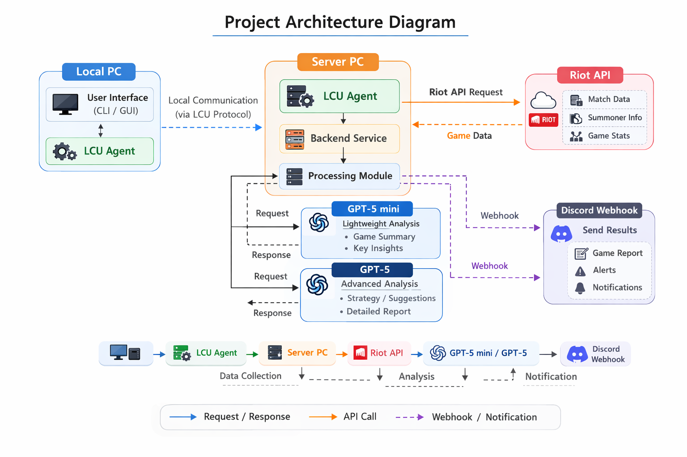

# DLoLSSfF
> **Discord-based League of Legends Support System for Friends**

매일 나와 함께 게임하는 친구들(일부는 실존 여부가 불확실하지만, 일단 존재한다고 가정)을 위한 디스코드용 LoL 서포트 시스템 제작 프로젝트

  <a>Developed by <strong>Si vales valeo#EUW</strong></a><a> | Go to </a><a href="https://github.com/ahndavin/DLoLSSfF">Core Repository</a>

---

## 🎮 이게 뭔가요?
DLoLSSfF는 여러분과 함께 게임할 때 조금 더 재미있게 플레이할 수 있도록 만든 **롤 보조 시스템**입니다.  
게임이 시작되기 전과 끝난 후에 필요한 정보를 자동으로 정리해서 **디스코드 채널**로 보내줍니다.

복잡한 설정 없이, 친구들과 게임을 더 재미있게 하려는 개인 프로젝트입니다 🙂

---

## ✨ 어떤 걸 해주나요?
현재 버전에서는 아래 기능을 지원합니다.

- ✅ **매치 자동 수락** (`DLoLSSfF Agent` 필요)  
  게임을 찾으면 자동으로 수락해줘요.  

- 📊 **팀 조합 분석 보고서**  
  챔피언 선택이 끝나면 챔피언 조합을 간단하게 분석해서  
  각 라인별로 참고할 만한 팁을 알려줍니다.

- 🏆 **경기 요약 보고서**  
  게임이 끝나면 MVP 및 MuVP와 함께 요약 보고서를 만들어 디스코드에 올려줘요.

---

## 🚀 앞으로 추가될 기능
- 📅 주간 팀 또는 개인 보고서
- 🧠 상대 픽의 카운터 챔피언 추천
- 🤝 팀 조합에 어울리는 챔피언 추천

※ 개인 프로젝트라서 업데이트 방향은 조금씩 바뀔 수 있어요.

---

## 🧩 어떻게 동작하나요? (`DLoLSSfF Agent` 필요)
1. 내 컴퓨터에서 게임 상태를 확인합니다.
2. 서버가 필요한 정보만 모아서 분석합니다.
3. 결과를 디스코드 채널로 보내줍니다.

> 자세한 구조는 아래 아키텍처 이미지를 참고하세요.

---

### ⚠️ 참고사항
- 이 프로젝트는 **여러분과 사용하려고 만든 개인용 도구**입니다.
- 공식 Riot 서비스가 아니며, **상업적인 목적**이 없습니다.
- 일부 기능은 **특정 게임 모드**에서만 동작할 수 있습니다.
- 일부 기능은 서버 안정성 확보를 위해 **특정 사용자**에게만 제공될 수 있습니다.
- 각 리포트는 Open AI가 생성하며 보고서 당 **0.02-0.1 USD의 비용**이 발생합니다.

---

## Thanks to
저와 함께 롤을 플레이하여 제게 아이디어를 준 친구들 🙂
- **Bami on bush#BAMI** (재검증 필요)
    - 드덴 대표 롤잘알로서 팀 조합 및 경기력 평가 기준을 제시함
- **Charmcharmcharm#EUW** (검증됨)
- **DaramZi#EUW** (검증 안됨)
  - 하노버 대표 컴알못으로서 DLoLSSfF Agent 배포 과정의 신뢰성에 대한 사용자 관점 리스크 평가를 수행함.
- **FTFFMT#EUW** (검증 안됨)
- **ichbinjinn#EUW** — (검증 안됨)
  - 디코 채널 'LOL'의 채널장으로서 DLoLSSfF를 채널에 공식 편입을 허가하고, 개발자에게 시스템 통합에 필요한 채널 권한을 승인함
- **Ochris#Korea** — (검증 안됨)
- **Pabet#KOR** — (검증 안됨)
- **PooParty Edwin#0307** — (검증 안됨)
- **Sillim#EUW** — (재검증 필요)
- **곽병팔#1649** — (검증됨)
  - 디코 채널장의 혈육으로서 개발자의 요구사항을 방장에게 직통으로 전달하는 창구 역할을 수행함
- **파우더#0517** — (재검증 필요)
- **해당아이디는사용할수없습니다#1557** — (검증됨)
  - 유명한 비평가로서 초기 프로토타입 평가에 기여함

---

⭐ 이 프로젝트는 “개인적인 공부를 생산성있게 하기”라는 단순한 목표에서 시작되었습니다.
